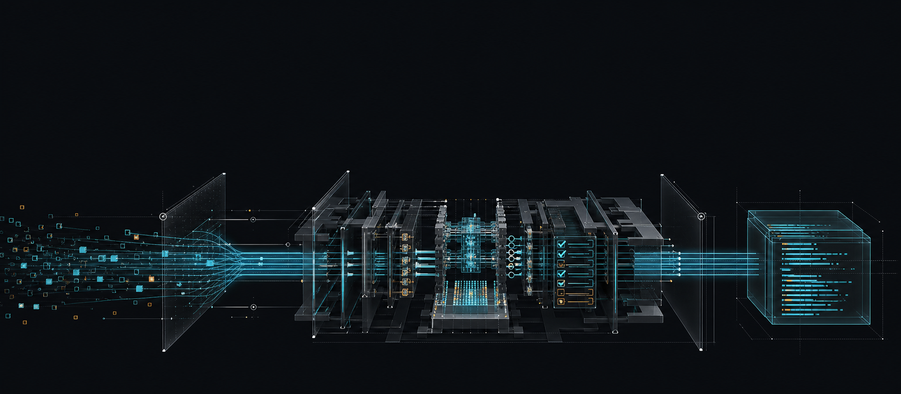
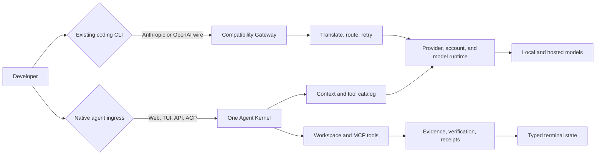
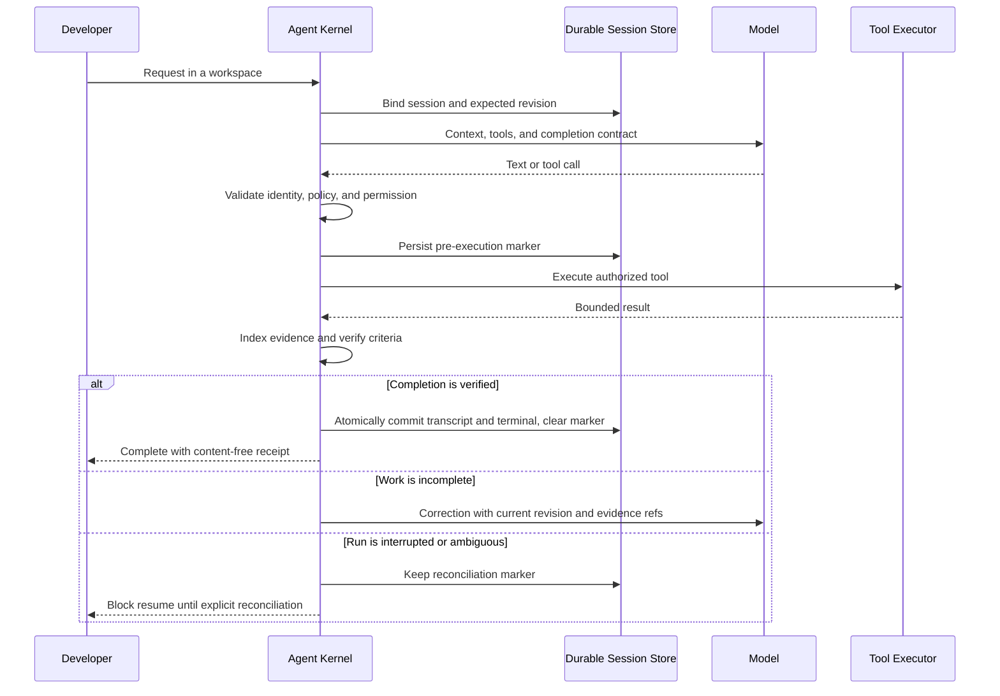
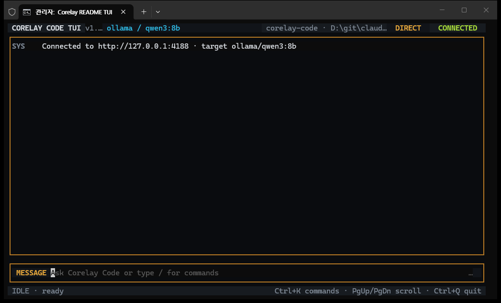
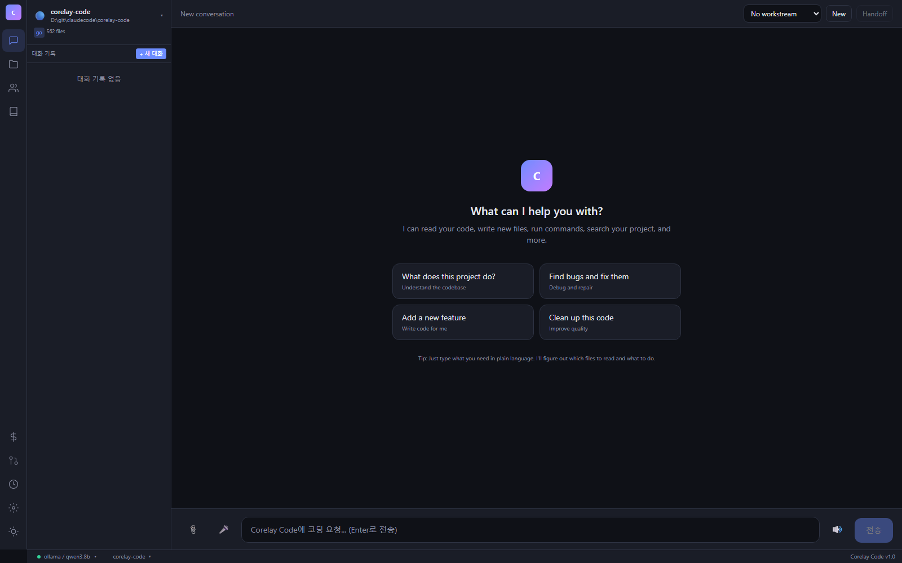

<p align="center">
  
</p>

<h1 align="center">Corelay Code</h1>

<p align="center"><strong>Relay model intent into verified code.</strong></p>

<p align="center">
  One agent kernel for Web, TUI, HTTP, ACP, teams, and background runs.<br />
  One compatibility gateway for the CLIs you already use.
</p>

## What it is

Corelay Code is an execution control plane for coding agents. It sits between a
model and a real workspace and owns the mechanics that models should not have to
get right by accident: tool contracts, permissions, context, durable sessions,
verification, recovery, and completion.

The name describes the boundary:

| Layer | Meaning |
|---|---|
| **Core** | One agent kernel gives every native ingress the same tool, safety, evidence, and terminal semantics. |
| **Relay** | Models, accounts, and compatible CLIs can change without changing the execution contract. |
| **Code** | A run is not finished because it produced prose; workspace changes must be executed, checked, and recorded. |

The model still supplies judgement. Corelay Code supplies the conditions under
which that judgement can survive stale edits, malformed calls, context pressure,
process death, and ambiguous side effects.

## Two paths, one runtime plane



The distinction is deliberate:

| | Native agent | Compatibility gateway |
|---|---|---|
| Entry points | Web, `corelaycode chat`, `/api/agent`, ACP | `/v1/messages`, OpenAI-compatible endpoints |
| Owns the agent loop | Corelay Code | The external CLI |
| Full tool and completion hardening | Yes | No; request shaping, translation, routing, and retry only |
| Best for | Local or hosted models that should execute inside Corelay Code | Keeping an existing CLI while changing its provider path |

## How a run reaches done



The important ordering is authorization, then a synchronous write-ahead marker,
then execution. If the process dies after a side effect, a fresh process sees the
marker and refuses to replay the run until an operator reconciles it.

## Actual interfaces

### Full-screen terminal workbench

`corelaycode chat` opens the TUI when stdin and stdout are interactive.
`corelaycode tui` requires it explicitly.



The TUI keeps the active runtime ID separate from the durable session ID,
supports command search and session lifecycle actions, and treats approval and
reconciliation as fail-closed states rather than confirmation prompts that can
accidentally default to yes.

### Web workbench



The browser surface uses the same HTTP/SSE agent path and the same durable
session contract as the TUI. It also exposes projects, routing, accounts,
verification evidence, teams, memory, activity, and KAIROS background work.

## What the runtime owns

### Completion, evidence, and verification

- A reserved completion tool transitions a revisioned completion contract.
- Evidence references are digest-bound; raw assertions, tool inputs, and
  resolver errors are not echoed through terminal results.
- `done` is a typed terminal event, not a synonym for success.
- File-changing runs emit compact receipts under `~/.corelay/receipts/`.
- Failed agentic traces can be promoted to regression cases and replayed.

### Durable execution and recovery

- Sessions use revision CAS rather than last-write-wins updates.
- Every authorized side effect is journaled before the start event and executor.
- Successful completion atomically commits the transcript and terminal state
  while clearing the exact interruption marker.
- Cancel, crash, transport failure, or ambiguous persistence keeps the run
  quarantined until explicit reconciliation.
- Forked sessions preserve lineage without sharing mutable state.

### Tool safety and repair

- Bash, Read, Write, Edit, Glob, and Grep use workspace-scoped execution.
- Read-only tools may run concurrently; mutations remain serialized.
- Tool identity, permission, plugin, MCP, sandbox, and file-ownership checks are
  bound before execution.
- Failed edits return useful nearby lines; syntax-breaking edits can be rolled
  back and reported as failures instead of silent success.
- Tool output and transport errors are bounded and terminal control sequences
  are sanitized before rendering.

### Context and model breadth

- Context planning preserves required control tools while pruning optional ones.
- Long runs compact through bounded summarization with a deterministic fallback.
- Local model execution respects model, tool, web, and test capacity instead of
  multiplying requests beyond the machine's useful concurrency.
- Thinking streams from supported models are separated from final answers.
- The runtime can route across Ollama, SGLang, Anthropic, OpenAI, Gemini, Groq,
  GitHub Copilot, and z.ai-compatible models.

### Teams and autonomous work

- Team plans describe tasks, dependencies, file scopes, provider/model choices,
  resource reservations, and verification commands.
- Dependency waves run with bounded capacity and hard file ownership.
- Subagents, Team, Chronos, Bridge, profiler, HTTP, and ACP converge on the same
  kernel and terminal finalizer rather than maintaining alternate loops.
- KAIROS schedules background tasks, watches Git state, and emits notifications.

## Quick start

### Build from source

Requirements: Go, Node.js, and npm.

```bash
git clone https://github.com/Dannykkh/corelay-code.git
cd corelay-code
make all

# Start the server with a local model
./corelaycode -provider ollama -model qwen3:8b
```

The browser opens at `http://localhost:4000/app`.

In a second terminal, from the project the agent should edit:

```bash
corelaycode chat

# Require the full-screen TUI
corelaycode tui

# Non-interactive use
corelaycode chat -p "Find the failing test and fix it"
```

Windows uses the same commands with the `.exe` suffix.

### Docker Compose

```bash
docker compose up --build
```

The release workflow builds `corelaycode`, `corelaycode-acp`, and
`corelaycode-profile` for the supported platforms. Tagged releases also publish
the Corelay Code container image.

## Use an existing CLI as the loop owner

Start the Corelay Code server, then point a compatible CLI at it:

```bash
# Anthropic-compatible CLI
ANTHROPIC_BASE_URL=http://localhost:4000 \
CLAUDE_CODE_PROVIDER_MANAGED_BY_HOST=1 \
claude

# OpenAI-compatible CLI
OPENAI_BASE_URL=http://localhost:4000 codex
```

Your CLI retains its commands, subagents, skills, hooks, and memory because it
still owns the loop. Corelay Code provides the provider relay, protocol
translation, routing, account scheduling, tool-list shaping, and retry path.

## TUI controls

| Key | Action |
|---|---|
| `Enter` | Send or select |
| `Ctrl+K` | Open the command palette |
| `Ctrl+O` | Open durable sessions |
| `Ctrl+N` | Start a new session |
| `PageUp` / `PageDown` | Scroll the transcript |
| `End` | Follow new output |
| `Esc` / `Ctrl+C` | Cancel the active run exactly once |
| `Ctrl+Q` | Quit and restore the terminal |

Inside the palette, session actions include `/sessions`, `/load`, `/new`,
`/fork`, `/rename`, `/reconcile`, `/close`, and `/delete`. Approval is explicit:
`A` allows once; `D`, `Esc`, or `Enter` denies.

## Configuration and migration

Corelay Code writes new state under `~/.corelay` and reads `CORELAY_*`
environment variables first. Existing `~/.aniclew`, `~/.claude-proxy`, and
`ANICLEW_*` values remain read-compatible migration fallbacks.

Minimal `~/.corelay/config.json`:

```json
{
  "port": 4000,
  "defaultProvider": "ollama",
  "defaultModel": "qwen3:8b",
  "accessToken": "",
  "projects": [
    { "path": "/path/to/project", "name": "My Project" }
  ]
}
```

When server authentication is enabled, prefer an environment variable so the
token does not enter shell history:

```bash
CORELAY_ACCESS_TOKEN=... corelaycode chat
```

## Main surfaces

| Surface | Purpose |
|---|---|
| `POST /api/agent` | Native coding agent over SSE |
| `POST /api/team` | Dependency-aware team execution over SSE |
| `POST /api/chronos` | Autonomous bounded run loop over SSE |
| `POST /v1/messages` | Anthropic-compatible provider gateway |
| `GET /api/runtime` | Providers, accounts, routes, quota windows, and telemetry |
| `GET/POST /api/sessions` | Durable session lifecycle |
| `GET /api/evidence/recent` | Verification policy and recent receipts |
| `GET /api/run-traces` | Agentic run traces and regression promotion |
| `corelaycode-acp` | Stable ACP adapter with the same durable execution rules |
| `corelaycode-profile` | Repeatable model and capability profiling |

The server has narrower endpoints for projects, files, permissions, MCP,
plugins, memory, workstreams, hooks, commands, skills, usage, feedback, KAIROS,
and worktrees. The Web UI is the easiest way to explore them.

## Design boundaries

Corelay Code does not make a model more capable. It removes execution failures
that are unrelated to the model's judgement. A model that misunderstands the
task or cannot devise the algorithm can still fail.

The compatibility gateway also cannot apply native-agent completion semantics
to an external CLI's private loop. Use the native Web, TUI, API, or ACP path when
you need Corelay Code to own tools, evidence, durable execution, and the meaning
of done.

For the detailed contracts, see:

- [Agent Operating Model](docs/agent-operating-model.md)
- [Domain Dictionary](docs/domain-dictionary.md)
- [Capability architecture and flows](docs/plan/agent-capability-absorption/)
- [Local-model edit-repair measurement](docs/measurements/local-model-edit-hint.md)
- [IP provenance and limitations](docs/ip-provenance.md)

## License

MIT
