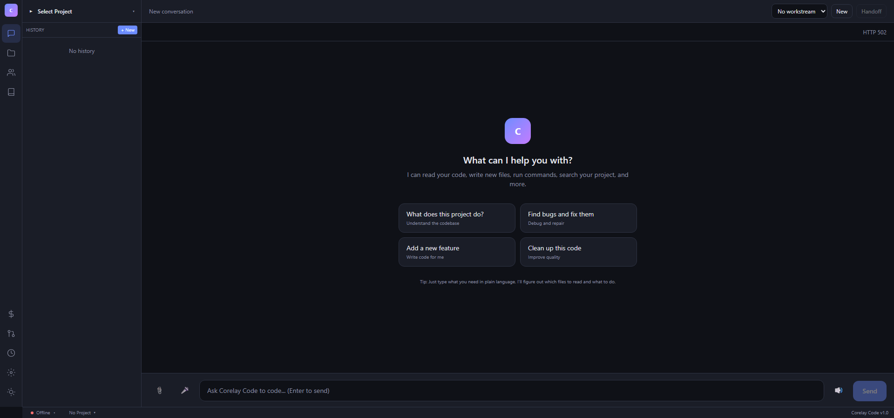
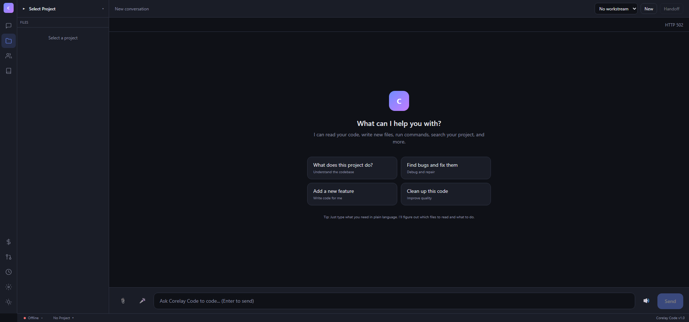
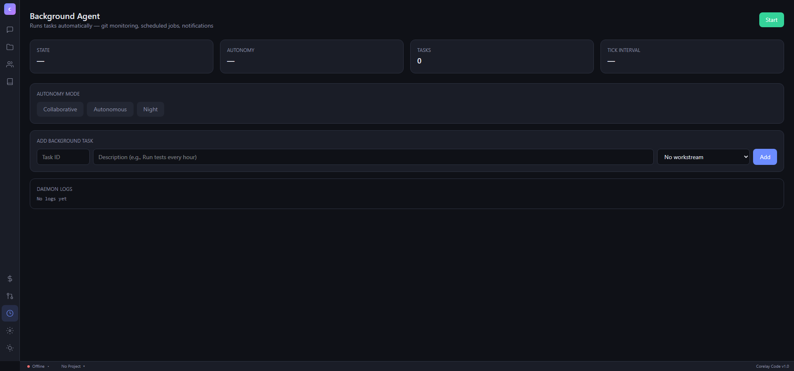
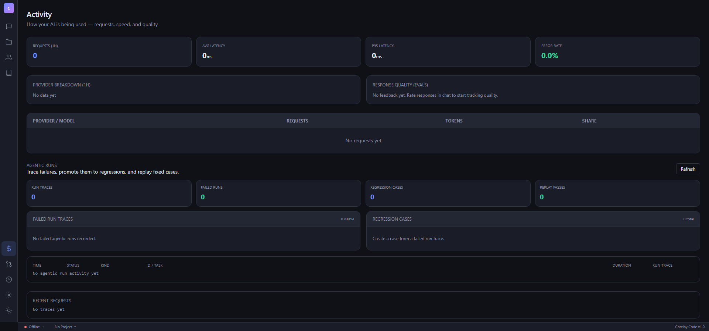

# AniClew

**Run Claude Code on your own models.**

Point Claude Code — or Codex CLI, or Gemini CLI — at AniClew and it keeps
working: same commands, same subagents, same skills, same project memory. Behind
it, the model can be Ollama, SGLang, or anything else you host.

The hard part is not translating an API. It is that a local model fails
differently. It emits a tool call with the wrong shape, stops mid-sequence, or
quietly runs past its context window — and a harness built for a hosted model
reads that as success. AniClew absorbs those failures in the runtime layer so
the harness never sees them.

Everything else here — multi-provider routing, account and quota scheduling,
teams, the daemon, observability — exists to keep that substitution working
under real use.

## Screenshots

| Chat (Thinking model) | Project Browser |
|------|----------------|
|  |  |

| KAIROS Daemon | Observability |
|--------------|----------|
|  |  |

## Features

### Local Model Runtime

Where most of this project's work went. A router gets a local model *answering*;
this is what it takes to make one usable through a real coding harness.

- **Harness stays put**: `ANTHROPIC_BASE_URL` or `OPENAI_BASE_URL` is the only
  change. Slash commands, subagents, skills, hooks, and project memory keep working
- **Protocol translation**: Anthropic Messages and OpenAI-compatible shapes are
  converted both ways, including streaming and tool-call frames
- **Thinking models**: qwen3 and DeepSeek-R1 reasoning is parsed out of the
  stream rather than leaking into the answer, and shown as collapsible blocks in
  the web UI
- **Context auto-compaction**: LLM-based summarization with a snip fallback and a
  circuit breaker, so a long run degrades instead of dying at the window edge
- **Capacity-aware execution**: local defaults hold Ollama/SGLang to a single
  model worker while still allowing bounded tool and web fan-out — one 8B model
  does not get eight concurrent requests
- **Failure absorption**: malformed tool calls, truncated sequences, and
  transient provider errors are retried or repaired below the harness, which is
  what keeps a weak model from silently reporting success

### Multi-Provider Proxy
- **7 providers**: Anthropic, OpenAI, Gemini, Groq, Ollama, GitHub Copilot, z.ai (Grok)
- **Auth passthrough**: CLI tools send their own API keys through AniClew transparently
- **Runtime switching**: Change provider/model without restarting
- **Smart retry**: Exponential backoff with jitter, 529 fallback model switching
- **Smart router**: Auto-route requests by role (coding, review, chat)

### Coding Agent
- **Tool-using agent**: Bash, Read, Write, Edit, Glob, Grep
- **23 security validators**: Shell injection detection, dangerous path blocking, sed/jq execution prevention
- **60+ read-only allowlist**: Per-command flag validation for safe auto-approval
- **Parallel tool execution**: Read-only tools run concurrently, write tools serial
- **Verification receipts**: File-changing runs write compact JSON proof under `~/.claude-proxy/receipts/`

### Account & Quota Scheduling

Applies to hosted accounts; local models skip most of it.

- **Per-account quota windows**: five-hour and seven-day usage tracked separately
  per account, not just a global rate limit
- **Health-aware selection**: accounts are scored and only eligible ones are
  picked; unhealthy accounts are skipped rather than retried into the ground
- **Soft vs hard cooldown**: a 429 quota cooldown survives later successes; a
  transient 5xx only triggers a short avoidance window
- **Escalating backoff**: repeated transient failures step 30s to 2m to 10m to
  30m, and an account recovers only after two consecutive successes
- **Session leases**: a run sticks to its account for continuity and is
  re-evaluated on a fixed interval instead of every request
- **Deterministic rotation**: when every account is stale, selection round-robins
  instead of hammering the same one
- **Quota collectors**: file or HTTP snapshots update scheduler state without
  hand-editing config

### Multi-Agent Teams
- **TeamPlan contract**: Provider-neutral Daedalus-style plan with AgentTask, AgentSpec, stages, dependencies, and evidence criteria
- **Resource-aware waves**: Team waves are internally batched by model/tool/web/test slots and file-scope locks
- **Task routing**: TeamPlan tasks can override provider/model for role-specific execution
- **Team dashboard**: The web Team page submits objectives, verification commands, capacity, per-task kind/role/provider/model, read-only mode, dependencies, file scopes, and resource reservations
- **Plan CLI**: `aniclew team plan --objective "..." --out team-plan.json`, `aniclew team validate --plan team-plan.json`
- **CLI worker/team**: `aniclew worker run --provider ollama --model qwen3:8b --task task.json` or `aniclew team run --plan team-plan.json`
- **Team receipts**: Team and worker runs write `team-*.json` receipts with task status, provider/model, verification state, and output file pointers
- **Wave execution**: Topological sort (Kahn's algorithm) for dependency-based parallelism
- **File ownership**: Hard enforcement at ExecuteTool level
- **6 agent types**: Explorer, Researcher, Planner, Coder, Reviewer, Tester
- **Mailbox**: File-based inter-agent messaging with locking + broadcast
- **Message router**: Live channel delivery with mailbox fallback
- **Plan mode**: Explore -> Design -> Approve -> Implement lifecycle
- **Worktree isolation**: Git worktree per agent for conflict-free parallel work
- **Idle detection**: Callback chain with timestamp tracking

### Project Management
- **Multi-project**: Register, switch, remove projects via folder browser
- **File tree**: Recursive tree with click-to-view file content
- **Session isolation**: Per-workspace chat history filtering
- **Auto-detection**: Go, Node, Python, Rust, Java, .NET framework detection

### KAIROS Daemon
- **Background agent**: 2-minute tick cycle with cron scheduling
- **Cron parser**: 5-field expressions + presets (@hourly, @daily, @every 5m)
- **Git Watch**: Auto-monitors git status, detects changes, logs summaries
- **Notifications**: SSE real-time stream + webhook integration
- **Per-project**: Tasks and memory isolated per workspace

### Observability
- **Request tracing**: Per-request provider, model, latency, tokens, cost (JSONL persistence)
- **Agentic run traces**: Chronos and Team runs record durable run traces with spans, receipts, and workstream metadata
- **Regression replay**: Failed Chronos/Team traces can be promoted into regression cases and replayed from captured task inputs or Team receipts
- **Metrics**: Average/P95 latency, error rate, requests/min, per-provider breakdown
- **Stream watchdog**: 90s idle timeout with context abort
- **Response quality**: Thumbs up/down feedback with per-model scoring
- **Prompt cache**: Strategy tracking, break detection, savings estimation

### Hooks & Permissions
- **Hook system**: CLI-aware loading (Claude/Codex/Gemini settings), pre/post tool use
- **6-level permission cascade**: CLI flags > policy > local > user > project > defaults
- **Immutable snapshots**: Captured at session start, no mid-session drift
- **Denial tracking**: Auto-persist deny rule after 3 consecutive denials
- **Permission persistence**: Allow/deny rules saved to .claude/settings.json

### Security
- **Token auth**: Optional `accessToken` in config
- **Path sandboxing**: Tools restricted to workspace directory
- **BashTool**: Quote-aware parser, compound command splitting, auto-backgrounding
- **Exit code semantics**: grep 1 = no match (not error), diff 1 = files differ

### Extensibility
- **Plugin system**: JSON manifest with tools, hooks, commands, agent types
- **MCP integration**: Stdio client with timeout, health check, auto-reconnect
- **Bridge mode**: HTTP remote control for IDE/script integration
- **Session memory**: Disk-backed large result storage (saves tokens)

## Agent Operating Model

The agent loop is organized around a compact operating model: chat, plan,
execute, verify, team, memory, and skill extraction. See
[docs/agent-operating-model.md](docs/agent-operating-model.md) for the
invariants, receipt schema, and cleanup direction.

## Installation

### Option 1: Script (Mac/Linux)

```bash
curl -fsSL https://raw.githubusercontent.com/Dannykkh/Ani-Clew/main/install.sh | bash
```

### Option 2: Docker

```bash
# With Ollama (local LLM)
docker compose up -d

# AniClew only (bring your own LLM)
docker run -p 4000:4000 -v $(pwd):/workspace ghcr.io/dannykkh/aniclew
```

### Option 3: Build from source

```bash
git clone https://github.com/Dannykkh/Ani-Clew.git && cd Ani-Clew
make all    # builds frontend + backend
./aniclew   # interactive provider select
```

### Option 4: Download binary

Go to [Releases](https://github.com/Dannykkh/Ani-Clew/releases) and download for your platform.

## Quick Start

```bash
# Start with Ollama (local, free)
./aniclew -provider ollama -model qwen3:14b

# Start with OpenAI
OPENAI_API_KEY=sk-... ./aniclew -provider openai -model gpt-4o

# Start with Anthropic
ANTHROPIC_API_KEY=sk-ant-... ./aniclew -provider anthropic -model claude-sonnet-4-6-20250217
```

Browser opens at `http://localhost:4000/app`.

### Connect your CLI tools

```bash
# Claude CLI → AniClew → any model
ANTHROPIC_BASE_URL=http://localhost:4000 claude

# Codex CLI → AniClew → any model
OPENAI_BASE_URL=http://localhost:4000 codex
```

## Configuration

`~/.claude-proxy/config.json`:

```json
{
  "port": 4000,
  "defaultProvider": "ollama",
  "defaultModel": "qwen3:14b",
  "accessToken": "",
  "projects": [
    { "path": "/path/to/project", "name": "My Project" }
  ],
  "providers": {
    "ollama-remote": { "baseUrl": "http://192.168.1.100:11434" }
  }
}
```

## Architecture

```
CLI Tools (Claude Code / Codex / Gemini)   <- unchanged
        |
        v   ANTHROPIC_BASE_URL / OPENAI_BASE_URL
  +-----------+     +---------+
  |  AniClew  | <-> | Web UI  |
  +-----------+     +---------+
   |
   +-- Translate (Anthropic <-> OpenAI, streaming, tool frames)
   +-- Agent Loop (tools, hooks, permissions, compaction)
   +-- Runtime Plane (accounts, 5h/7d windows, cooldowns, leases)
   |    |    |
   |    v    v
   | Ollama SGLang Anthropic OpenAI ...
   |
   +-- KAIROS Daemon (cron, git-watch)
   +-- Team (waves, mailbox, worktree)
   +-- Observability (traces, metrics, feedback)
   +-- Plugins (tools, hooks, commands)
```

## API

| Endpoint | Description |
|----------|-------------|
| `POST /v1/messages` | Anthropic-compatible proxy |
| `GET /api/runtime` | Runtime status: accounts, routing, quota windows |
| `GET /api/runtime/telemetry` | Account health, cooldowns, selection telemetry |
| `GET/POST /api/runtime/quota-sources` | Quota collectors (file / HTTP) |
| `POST /api/runtime/quota-sources/test` | Validate a collector before saving |
| `GET/PUT /api/config` | Provider & settings |
| `GET/POST/DELETE /api/projects` | Project management |
| `GET /api/tree` | File tree |
| `GET /api/file` | File content |
| `GET/POST /api/sessions` | Chat sessions |
| `POST /api/agent` | Coding agent (SSE) |
| `POST /api/team` | Team execution (SSE) |
| `POST /api/chronos` | Autonomous loop (SSE) |
| `GET /api/run-traces` | Agentic run traces |
| `POST /api/run-traces/{id}/regression` | Promote failed run trace to regression case |
| `GET /api/regressions` | Regression cases |
| `POST /api/regressions/{id}/run` | Replay regression case |
| `GET /api/regression-runs` | Regression replay attempts |
| `GET/POST /api/kairos/*` | Daemon control |
| `GET /api/traces` | Request traces |
| `GET /api/metrics` | Computed metrics |
| `GET/POST /api/feedback` | Response quality |
| `GET /api/hooks` | Loaded hooks |
| `GET /api/permissions` | Permission snapshot |
| `GET /api/agent-types` | Available agent types |
| `GET /api/worktrees` | Git worktrees |
| `GET /api/mcp` | MCP servers |

## Stats

- **43,300 lines** Go
- **302 test functions** across 18 internal packages
- `go build ./... && go vet ./... && go test ./...` green as of 2026-07-25

## License

MIT
