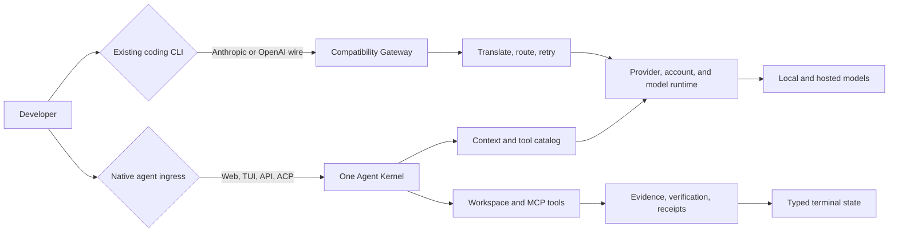
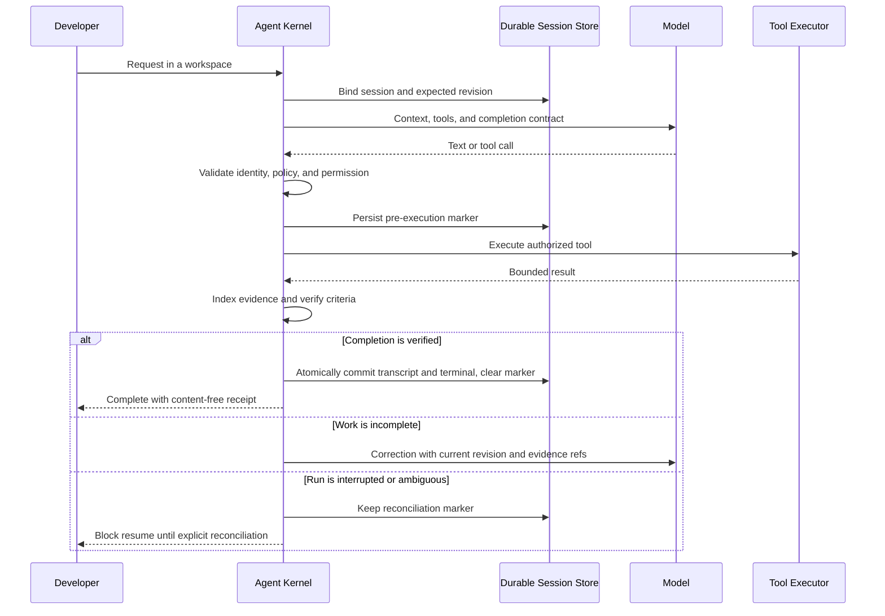

<p align="center">
  
</p>

<h1 align="center">Corelay Code</h1>

<p align="center"><strong>Turn development failures into tested improvements.</strong></p>

<p align="center">
  Execute development tasks, preserve evidence, and evaluate improvements.<br />
  A shared agent harness for local and hosted models, with a gateway for existing CLIs.
</p>

## Purpose

Corelay Code aims to reduce repeated failures and the human intervention needed
when AI agents work on real software projects. Its intended use is development
work itself: run a task, preserve what happened, reproduce failures, and test
whether a change makes the next run more reliable.

A **harness** supplies the execution environment around the model: tools,
permissions, project context, verification, and recovery. Corelay provides that
foundation and is building a bounded self-improvement loop on top of it.
The model supplies reasoning; the harness makes its actions and results
observable and checkable.

The success criterion is fewer repeated mistakes and less user intervention on
real tasks, with acceptable time and cost. Tool count, generated code volume,
and a model saying “done” are not sufficient evidence of progress.

## Problems it addresses

An agent can invoke tools and still fail to finish useful work. It may send
invalid arguments repeatedly, edit stale content, lose requirements in a long
conversation, or report completion without successful verification. A canceled
or crashed run can also leave changes whose status is unclear.

Corelay makes these conditions explicit so a failed run can become something
that can be investigated, reproduced, and eventually improved. That goal is
broader than the current implementation: production failure collection,
reproducible tasks, candidate generation, and independent evaluation are not yet
one fully automatic pipeline.

## What exists to address them

| Need | Current mechanism | Boundary |
|---|---|---|
| Execute work consistently | Shared agent kernel for Web, TUI, HTTP, ACP, team workers, and background work | Model quality still affects task success; not every ingress supports every workflow |
| Keep projects and actions under control | Workspace/session binding, permissions, approvals, sandbox adapters, tool validation | Isolation depends on the configured platform/backend; this is not a complete security certification |
| Detect incomplete work | Verification commands, completion evidence, typed terminal states, execution receipts | Passing a fixture does not prove an arbitrary user task is complete |
| Recover from interruption | Durable sessions, revision checks, write-ahead markers, checkpoints and reconciliation | Ambiguous side effects require reconciliation rather than automatic replay |
| Turn failures into test material | Failed Chronos/Team traces can be promoted to regression cases | Production traces are not yet automatically converted into safe, isolated acceptance tasks |
| Evaluate behavior before adoption | Profiler with isolated calibration, holdout and safety probes; immutable profiles | Fixed-suite measurements do not establish general or statistically reliable improvement |
| Learn bounded workflow reminders | `improve --learn` proposes reminders from repeated calibration failures, runs control/candidate evaluations, and publishes only accepted candidates | Four code-owned reminder types; no arbitrary skill generation, source-code rewriting, or model training |
| Use accepted lessons in later work | Exact-target automatic profile selection injects evaluated reminders into subsequent matching native runs | Requires compatible, current evidence and the configured runtime profile store |
| Study self-questioning without changing a run | An opt-in shadow observer records bounded judgments; `shadow-eval` compares them with curated labels and a fixed rule; `shadow-judge` calls local Ollama or TypeSafe Jev for an offline comparison | The normal agent path has no judge; model advice does not change tools, permissions, completion, or published profiles |
| Work with existing tools and models | Local/hosted providers, MCP, native tools, and a compatibility gateway for external coding CLIs | The gateway does not own or evaluate an external CLI's complete agent loop |

The native tools include file reading/search/editing, shell and test execution,
repository navigation, and web-page reading. `WebFetch` can render JavaScript
pages through local headless Chromium; this does not by itself provide general
click/type/login browser automation. See [web reading](docs/web-fetch.md) and
the [agent operating model](docs/agent-operating-model.md).

## Current self-improvement scope

The implemented lesson cycle is:

```text
Profiler calibration failures
  → propose a bounded set of workflow reminders
  → freeze the candidate instructions
  → run incumbent and candidate in separate fixture workspaces
  → compare verification, safety and per-attempt regressions
  → publish an accepted profile, or retain the incumbent
  → apply accepted reminders to subsequent matching native runs
```

Use `corelaycode-profile improve --baseline <profile-id> --learn --confirm`
with the same provider/model/store options as the baseline. This is an explicit,
bounded evaluation, not an always-running learning service. See the
[RSI contract, commands and limitations](docs/rsi.md).

**Current evidence:** local deterministic tests exercise failure handling,
control/candidate execution, persistence, rejection, and next-run injection.
A real agent loop dispatches tools in these tests, but the model is a fixture.
We have not demonstrated that this learning mechanism improves a live model's
performance, reduces user intervention, or beats other coding agents.

**Next milestone:** collect ten failures from actual development work, turn them
into reproducible acceptance tasks, and evaluate fixes against both those tasks
and separate tasks the candidate did not use for learning. Track task completion,
user interventions, elapsed time, cost, and false completion. Production trace
conversion, richer candidate generation, automatic rollback and scheduling
remain follow-up work. Existing coding agents may help author improvements;
Corelay must still evaluate whether those improvements are worth adopting.

### Self-questioning experiment

An explicitly injected shadow observer records bounded judgments after repeated
tool failures or a run-guard denial. It observes later errors but cannot change
the ongoing run. The default agent path has no judge. For an offline comparison,
the profiler can evaluate recorded answers against independently curated labels
and a fixed rule, or call a model on a selected corpus split:

```sh
corelaycode-profile shadow-eval --corpus cmd/corelaycode-profile/testdata/shadow/corpus.json --responses cmd/corelaycode-profile/testdata/shadow/responses.json --split development
corelaycode-profile shadow-judge --corpus cmd/corelaycode-profile/testdata/shadow/corpus.json --split development --provider ollama --model qwen3:0.6b --out responses.json
corelaycode-profile shadow-eval --corpus cmd/corelaycode-profile/testdata/shadow/corpus.json --responses responses.json --split development
```

The model command is opt-in and saves bounded answers, reported tokens, and
measured latency. Jev is an optional provider requiring `TYPESAFE_API_KEY`; it
has not been called live in this experiment. The bundled corpus is synthetic:
the local model calls validate the measurement path, not an improvement in real
coding tasks. Real reviewed cases and a separate evaluation split are still
needed before considering intervention. See the [shadow evaluation guide](docs/shadow-evaluation.md)
and [P3 results and limits](docs/plan/self-questioning-rsi/plan.md).

## Two paths, one runtime plane



The distinction is deliberate:

| | Native agent | Compatibility gateway |
|---|---|---|
| Entry points | Web, `corelaycode chat`, `/api/agent`, ACP | `/v1/messages`, OpenAI-compatible endpoints |
| Owns the agent loop | Corelay Code | The external CLI |
| Full tool and completion hardening | Yes | No; request shaping, translation, routing, and retry only |
| Best for | Local or hosted models that should execute inside Corelay Code | Keeping an existing CLI while changing its provider path |

## How a run reaches done



The important ordering is authorization, then a synchronous write-ahead marker,
then execution. If the process dies after a side effect, a fresh process sees the
marker and refuses to replay the run until an operator reconciles it.

## Actual interfaces

### Full-screen terminal workbench

`corelaycode chat` opens the TUI when stdin and stdout are interactive.
`corelaycode tui` requires it explicitly.


The TUI keeps the active runtime ID separate from the durable session ID,
supports command search and session lifecycle actions, and treats approval and
reconciliation as fail-closed states rather than confirmation prompts that can
accidentally default to yes.

### Web workbench


The browser surface uses the same HTTP/SSE agent path and the same durable
session contract as the TUI. It also exposes projects, routing, accounts,
verification evidence, teams, memory, activity, and KAIROS background work.

## What the runtime owns

### Completion, evidence, and verification

- A reserved completion tool transitions a revisioned completion contract.
- Evidence references are digest-bound; raw assertions, tool inputs, and
  resolver errors are not echoed through terminal results.
- `done` is a typed terminal event, not a synonym for success.
- File-changing runs emit compact receipts under `~/.corelay/receipts/`.
- Failed agentic traces can be promoted to regression cases and replayed.

### Durable execution and recovery

- Sessions use revision CAS rather than last-write-wins updates.
- Every authorized side effect is journaled before the start event and executor.
- Successful completion atomically commits the transcript and terminal state
  while clearing the exact interruption marker.
- Cancel, crash, transport failure, or ambiguous persistence keeps the run
  quarantined until explicit reconciliation.
- Forked sessions preserve lineage without sharing mutable state.

### Tool safety and repair

- Bash, Read, Write, Edit, Glob, and Grep use workspace-scoped execution.
- Read-only tools may run concurrently; mutations remain serialized.
- Tool identity, permission, plugin, MCP, sandbox, and file-ownership checks are
  bound before execution.
- Failed edits return useful nearby lines; syntax-breaking edits can be rolled
  back and reported as failures instead of silent success.
- Provider-native calls stay authoritative; bounded text recovery also handles
  Hermes, Liquid, Continue tool codeblocks, goose tokenized markers, and strict
  JSON before revalidating every candidate against the live catalog.
- Tool output and transport errors are bounded and terminal control sequences
  are sanitized before rendering.

### Context and model breadth

- Context planning preserves required control tools while pruning optional ones.
- `RepoMap` provides an on-demand, workspace-scoped view of source paths and
  declaration signatures without exposing file bodies or stored values.
- Long runs compact through bounded summarization with a deterministic fallback.
- Local model execution respects model, tool, web, and test capacity instead of
  multiplying requests beyond the machine's useful concurrency.
- Thinking streams from supported models are separated from final answers.
- The runtime can route across Ollama, SGLang, Anthropic, OpenAI, Gemini, Groq,
  GitHub Copilot, and z.ai-compatible models.

### Teams and autonomous work

- Team plans describe tasks, dependencies, file scopes, provider/model choices,
  resource reservations, and verification commands.
- Dependency waves run with bounded capacity and hard file ownership.
- Subagents, Team, Chronos, Bridge, profiler, HTTP, and ACP converge on the same
  kernel and terminal finalizer rather than maintaining alternate loops.
- KAIROS schedules background tasks, watches Git state, and emits notifications.

### Web page reading

`WebFetch` reads URLs through the existing agent tool dispatcher and returns
structured Markdown with optional query-relevant excerpts selected before
output truncation. It tries HTTP first and falls back to local headless Chromium
for JavaScript shells or HTTP failures. Rod manages the browser; no Python or
external browser server is required. Use `provider=browser` to force rendering.
See [web fetch configuration and limits](docs/web-fetch.md).

## Quick start

### Build from source

Requirements: Go 1.26.8 or later, Node.js, and npm.

```bash
git clone https://github.com/Dannykkh/corelay-code.git
cd corelay-code
make all

# Start the server with a local model
./corelaycode -provider ollama -model qwen3:8b
```

The browser opens at `http://localhost:4000/app`.

From the project the agent should edit, `corelaycode chat` connects to the
configured local server or starts a loopback-only managed server when that
endpoint is free. The managed server closes after its last CLI client exits.
An explicit `-url` is connection-only: a failed remote URL never starts a local
server, and an occupied local port is reused only when Corelay identity and
credentials are confirmed. Ctrl-C quits its CLI client without interrupting
other clients attached to the same managed server. To keep the server and
dashboard open independently, start the server command above as usual.

```bash
corelaycode chat

# Require the full-screen TUI
corelaycode tui

# Non-interactive use
corelaycode chat -p "Find the failing test and fix it"

# Machine-readable one-shot output
corelaycode chat -p "Summarize the changes" -format json
corelaycode chat -p "Summarize the changes" -format jsonl

# Resume or fork the same durable session in TUI, plain, or one-shot mode
corelaycode chat -session <id>
corelaycode chat -session <id> -fork -p "Try a different approach"

# CLI build metadata and read-only diagnostics
corelaycode version
corelaycode doctor
corelaycode doctor -url http://127.0.0.1:4000 -workdir .
```

`-format` defaults to `human`. The `json` format writes one versioned result
object to stdout. `jsonl` writes versioned event rows followed by exactly one
`result` row; rows include `schemaVersion`, `runId`, and increasing `seq`
values. Machine formats require `-p`, keep human progress and approval prompts
on stderr, and omit raw tool inputs. Exit codes are `0` for completion, `1` for
a failed or blocked run, `2` for invalid usage, and `130` when interrupted with
Ctrl-C.

`version` reports the CLI version, build commit, and Go runtime without reading
configuration or contacting a server. `doctor` checks installed browser, Git,
Bash, sandbox capability, MCP configuration counts, and server health. MCP
runtime state is reported as unknown because the CLI cannot observe the server
process's in-memory state. It does not download or launch a browser, start MCP
processes, or start/stop a server; server checks are limited to `GET /health`
and authenticated `GET /`, which provide the server version/build commit. It
omits credentials, provider/model values, command lines, environment values,
paths, and endpoint details from its output.
Doctor also reports whether the configured Go `gopls` executable is available;
semantic LSP calls fall back to a clearly labeled structural `RepoMap` result
when it is absent. Full execution mode uses the current OS account's privileges with sandbox isolation disabled; it does not elevate
privileges. For an explicit remote URL, pass its credential with `-token`;
ambient environment credentials are only used for loopback endpoints.

Windows uses the same commands with the `.exe` suffix.

### Docker Compose

```bash
docker compose up --build
```

The release workflow builds `corelaycode`, `corelaycode-acp`, and
`corelaycode-profile` for the supported platforms. Tagged releases also publish
the Corelay Code container image.

## Use an existing CLI as the loop owner

Start the Corelay Code server, then point a compatible CLI at it:

```bash
# Anthropic-compatible CLI
ANTHROPIC_BASE_URL=http://localhost:4000 \
CLAUDE_CODE_PROVIDER_MANAGED_BY_HOST=1 \
claude

# OpenAI-compatible CLI
OPENAI_BASE_URL=http://localhost:4000 codex
```

Your CLI retains its commands, subagents, skills, hooks, and memory because it
still owns the loop. Corelay Code provides the provider relay, protocol
translation, routing, account scheduling, tool-list shaping, and retry path.

## TUI controls

| Key | Action |
|---|---|
| `Enter` | Send or select |
| `Ctrl+K` | Open the command palette |
| `Ctrl+O` | Open durable sessions |
| `Ctrl+N` | Start a new session |
| `PageUp` / `PageDown` | Scroll the transcript |
| `End` | Follow new output |
| `Esc` / `Ctrl+C` | Cancel the active run exactly once |
| `Ctrl+Q` | Quit and restore the terminal |

Inside the palette, session actions include `/sessions`, `/load`, `/new`,
`/fork`, `/rename`, `/reconcile`, `/close`, and `/delete`. Approval is explicit:
`A` allows once; `D`, `Esc`, or `Enter` denies.

## Configuration and migration

Corelay Code writes new state under `~/.corelay` and reads `CORELAY_*`
environment variables first. Existing `~/.aniclew`, `~/.claude-proxy`, and
`ANICLEW_*` values remain read-compatible migration fallbacks.

Minimal `~/.corelay/config.json`:

```json
{
  "port": 4000,
  "defaultProvider": "ollama",
  "defaultModel": "qwen3:8b",
  "accessToken": "",
  "projects": [
    { "path": "/path/to/project", "name": "My Project" }
  ]
}
```

For semantic Go navigation, add `"lspExecutable": "gopls"` (or an absolute
configured executable path), or set `CORELAY_LSP_EXECUTABLE`. Corelay Code does
not install language servers; unavailable `gopls` calls use a labeled
structural `RepoMap` fallback.

When server authentication is enabled, prefer an environment variable so the
token does not enter shell history:

```bash
CORELAY_ACCESS_TOKEN=... corelaycode chat
```

## Main surfaces

| Surface | Purpose |
|---|---|
| `POST /api/agent` | Native coding agent over SSE |
| `POST /api/team` | Dependency-aware team execution over SSE |
| `POST /api/chronos` | Autonomous bounded run loop over SSE |
| `POST /v1/messages` | Anthropic-compatible provider gateway |
| `GET /api/runtime` | Providers, accounts, routes, quota windows, and telemetry |
| `GET/POST /api/sessions` | Durable session lifecycle |
| `/api/workstreams/{id}/plans/...` | Revisioned Workstream Plans, approval, stage evidence, and explicit interrupted-stage recovery ([guide](docs/workstreams.md)) |
| `GET /api/evidence/recent` | Verification policy and recent receipts |
| `GET /api/run-traces` | Agentic run traces and regression promotion |
| `corelaycode-acp` | Durable ACP sessions; workflow-bound sessions require the native Web/API path |
| `corelaycode-profile` | Repeatable model and capability profiling |
| `corelaycode-profile version` | Offline profiler build metadata |
| `corelaycode update` | Explicit local artifact verification and install |

The server has narrower endpoints for projects, files, permissions, MCP,
plugins, memory, workstreams, hooks, commands, skills, usage, feedback, KAIROS,
and worktrees. The Web UI is the easiest way to explore them.

Native API requests carry the selected project/workspace and execution policy
into the same run-owned kernel as Web and TUI. Session and Workstream mutations
use expected revisions; SSE terminal results are not treated as successful
completion without the corresponding durable evidence. The compatibility
gateway under `/v1/*` translates requests but does not claim ownership of the
external CLI's private loop.

The local Web UI authenticates by exchanging a single-use, 60-second challenge
for its HttpOnly cookie. Challenges are bound to the requesting Host and Origin;
service credentials are never placed in the URL.

ACP currently rejects sessions carrying Workstream/Plan/Stage bindings before
loading or running them. Those workflows require the native Web/API path until
ACP supports their approval, revision, and stage-evidence lifecycle.

### Compare the harness against its minimal ablation

`corelaycode-profile` can run the same isolated fixtures with adaptive
assistance enabled or disabled. Both variants retain the Agent Kernel,
approval, target binding, sandboxing, and safety probes.

```bash
# Inspect the bounded plans before spending model time
corelaycode-profile dry-run --variant minimal
corelaycode-profile dry-run --variant corelay
corelaycode-profile version

# Publish immutable profiles for the exact same provider/model target
corelaycode-profile run --variant minimal --confirm --measurement-only
corelaycode-profile run --variant corelay --confirm --measurement-only

# Compare the profile IDs returned by the two runs
corelaycode-profile compare --baseline <minimal-profile-id> --candidate <corelay-profile-id>
```

The comparison is content-free and fails closed unless target, plan version,
case shape, and safety evidence are compatible. The default plan also includes
six bounded real-task fixtures: multi-file bug repair, new feature plus test,
failing-test repair, decision retention, project switching, and interrupted
checkpoint recovery. Coding tasks require both matching file snapshots and
executed Go test assertions in a separate sandbox with filesystem, network, and
process isolation. Missing isolation or an unavailable Go toolchain cannot
produce a passing result. The v4 plan separates this acceptance from older
snapshot-only profiles. A safety regression overrides all apparent performance
gains.
Lifecycle tasks run the production compactor, reopen durable sessions across
project A/B/A selections, and cancel a completed fixture write before reconciling
its checkpoint and resuming without replay. Deterministic provider tests verify
these paths; they do not establish live-model quality or an OS crash benchmark.
`--measurement-only` changes only the process exit code after immutable
publication; quarantined profiles remain ineligible for automatic harness
selection.

For a same-harness profile refresh with a comparison gate, use
`corelaycode-profile improve --baseline <profile-id> --confirm` with the same
target options. Rejected candidates remain outside automatic selection; accepted
candidates publish through the existing profile store. See the
[RSI adoption contract](docs/rsi.md) for criteria, exit codes, and remaining
work toward a full improvement loop.
Add `--learn` to derive bounded workflow reminders from repeated calibration
failures and execute a fresh control/candidate comparison before adoption.

`corelaycode update` is an explicit local artifact operation. Supply an artifact
and the SHA-256 from the release channel, for example
`corelaycode update -artifact ./corelaycode-vX.Y.Z-windows-amd64.exe -sha256 <digest>`.
It verifies the digest, keeps the previous executable beside the target, and
does not discover or download releases in the background. On Windows, when the
target is the running executable, it starts a one-shot helper that waits for the
explicit update command to exit before replacing the file and verifying the
result. A different in-use target is rejected without removing the current file.
Restore the retained copy explicitly with
`corelaycode update -rollback -target <path> -backup <path>.previous`.

## Design boundaries

Corelay Code does not make a model more capable. It removes execution failures
that are unrelated to the model's judgement. A model that misunderstands the
task or cannot devise the algorithm can still fail.

The compatibility gateway also cannot apply native-agent completion semantics
to an external CLI's private loop. Use the native Web, TUI, API, or ACP path when
you need Corelay Code to own tools, evidence, durable execution, and the meaning
of done.

For the detailed contracts, see:

- [Agent Operating Model](docs/agent-operating-model.md)
- [Domain Dictionary](docs/domain-dictionary.md)
- [Capability architecture and flows](docs/plan/agent-capability-absorption/)
- [Reference capability absorption v2](docs/plan/reference-capability-absorption-v2/)
- [Local-model edit-repair measurement](docs/measurements/local-model-edit-hint.md)
- [IP provenance and limitations](docs/ip-provenance.md)

## License

MIT
